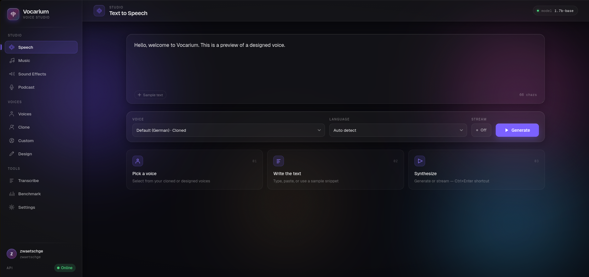
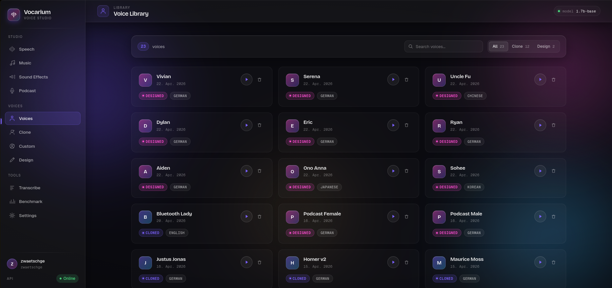
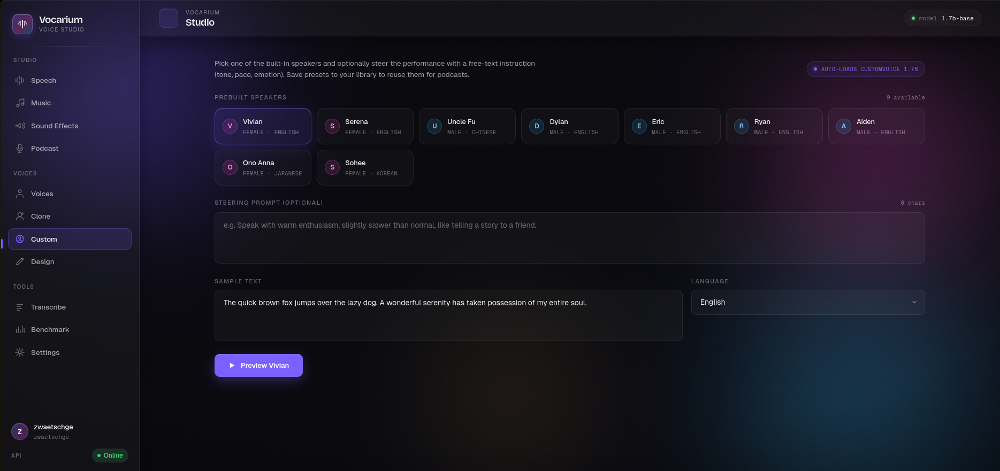
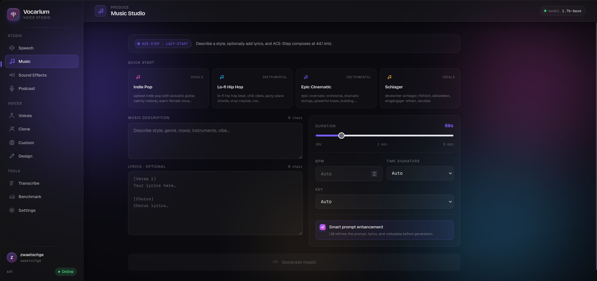
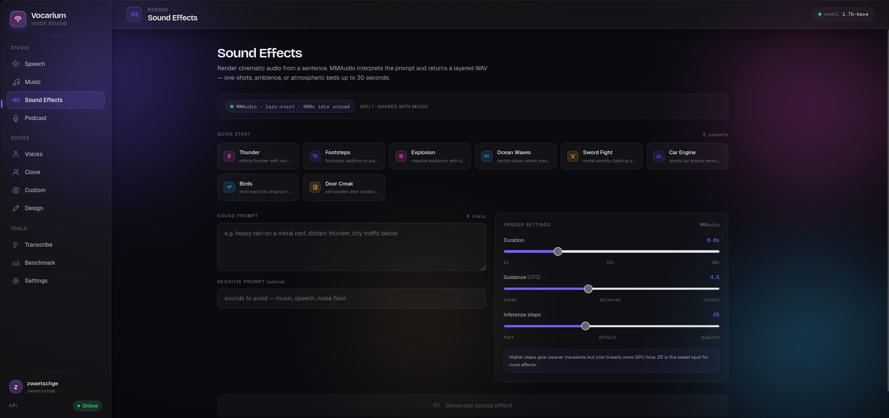
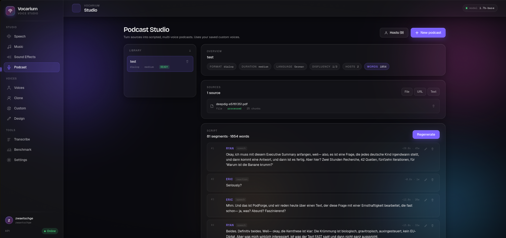

# Vocarium

Self-hosted voice platform with an ElevenLabs-compatible API. Runs entirely
on your hardware — no per-character billing, no upload of recordings to a
third party. One Docker Compose stack gives you:

- **TTS** — Qwen3-TTS 1.7B in three flavours: voice cloning, voice design
  from a description, and 9 prebuilt speakers with emotion steering.
- **ASR** — Qwen3-ASR transcription for voice cloning and arbitrary audio.
- **Music** — ACE-Step text-to-music with optional lyrics.
- **SFX** — MMAudio sound effects from text prompts.
- **Podcast Studio** — turn an uploaded PDF or document into a multi-host
  dialogue script and render it across both GPUs in parallel.
- **React UI** with pages for every feature, plus a settings panel for
  per-user LLM provider configuration.

The API is OpenAI-style on the inference path (`/v1/audio/speech`,
`/v1/audio/transcriptions`, `/v1/voices`) and ElevenLabs-style on the
management path (`/api/voices/clone`, `/api/generate`, `/api/transcribe`).

---

## Screenshots

**Text to Speech** — pick a voice, paste text, generate or stream.


**Voice Library** — every cloned, designed and prebuilt voice in one place.


**Custom voices** — nine prebuilt speakers with optional steering prompt.


**Music Studio** — ACE-Step text-to-music with optional lyrics and presets.


**Sound Effects** — MMAudio cinematic sound design from a sentence.


**Podcast Studio** — turn a PDF into a multi-voice scripted podcast.


---

## Hardware

- **GPU**: NVIDIA, ≥ 12 GB VRAM. **One GPU is the default** — TTS, ASR,
  music, and SFX share the GPU and auto-unload when idle. A second GPU
  is optional (opt-in via `COMPOSE_PROFILES=dual-gpu`) and adds a parallel
  TTS replica plus dedicated music/SFX placement.
- Tested on **RTX 3060 (12 GB)** and **RTX 5060 Ti (16 GB, Blackwell SM 12.0)**.
- **CPU/RAM**: 8 cores, 32 GB RAM is comfortable.
- **Disk**: ~25 GB for model weights + working space for generated audio.

> **Blackwell users (RTX 50xx)**: `flash-attn` is incompatible. The default
> `TTS_ATTN_IMPL=eager` works. First inference compiles kernels (~15 s) —
> not a hang.

---

## Quick start

```bash
git clone https://github.com/<your-fork>/vocarium.git
cd vocarium
./scripts/install.sh
```

That's it. The installer:
1. Verifies Docker, Compose v2, and the NVIDIA Container Toolkit.
2. Copies `.env.example` → `.env` (review it before re-running).
3. Pulls the Qwen3 TTS + ASR weights (~10 GB) into `./models/` and
   `./qwen3-tts/models/`.
4. Builds and starts the containers.
5. Smoke-tests the API.

When it finishes, open **http://localhost:3100**.

### Without the installer

```bash
cp .env.example .env                  # adjust if needed
./scripts/download-models.sh          # one-time, ~10 GB
docker compose up -d
```

For production deployments behind a reverse proxy:

```bash
docker compose -f docker-compose.yml -f docker-compose.prod.yml up -d
```

The `prod` overlay drops the host port mappings of internal services so
only the UI (and optionally the gateway) are reachable from outside the
`voice-network` bridge.

---

## Configuration

Everything is in `.env`. Highlights:

| Variable           | Default        | Notes                                                     |
|--------------------|----------------|-----------------------------------------------------------|
| `VOCARIUM_UI_PORT` | `3100`         | Public UI port.                                           |
| `VOCARIUM_API_PORT`| `8280`         | Gateway API.                                              |
| `GPU_TTS_1`        | `0`            | GPU index for the primary TTS replica.                    |
| `GPU_ASR`          | `0`            | GPU index for ASR. Coexists with TTS via idle-unload.     |
| `GPU_MUSIC` / `GPU_SFX` | `0` / `0` | Default: same GPU as TTS. Re-pin to `1` for dual-GPU.     |
| `COMPOSE_PROFILES` | (empty)        | Set to `dual-gpu` to enable a second TTS replica.         |
| `TTS_URL_2`        | (empty)        | Set to `http://qwen3-tts-2:8880` in dual-GPU mode.        |
| `TTS_IDLE_TIMEOUT` | `120` s        | Auto-unload after this idle period. `0` = never.          |
| `ALLOW_ANONYMOUS`  | `true`         | Single-user fallback when no `Remote-User` header.        |
| `CORS_ORIGINS`     | `*`            | Restrict to your UI origins in production.                |
| `DEFAULT_TTS_MODEL`| `1.7b-base`    | One of `1.7b-base`, `1.7b-design`, `1.7b-custom`.         |
| `LLM_API_URL` etc. | (empty)        | Required for **Podcast Studio**; see below.               |

### Dual-GPU mode (optional)

If you have two GPUs, uncomment two lines in `.env` to spin up a second
TTS replica on GPU 1 and pin music/SFX there:

```
COMPOSE_PROFILES=dual-gpu
TTS_URL_2=http://qwen3-tts-2:8880
GPU_MUSIC=1
GPU_SFX=1
```

Then `docker compose up -d` brings up the extra `qwen3-tts-2` and
`vocarium-api-2` containers. With one GPU, leave these commented and the
auto-unload logic (`*_IDLE_TIMEOUT`) keeps everything coexisting on GPU 0.

### Authentication

Vocarium is multi-tenant: every voice and podcast is scoped to a user.
Identity is read from the `Remote-User` (Authelia) or `X-Forwarded-User`
(oauth2-proxy, Cloudflare Access) header. Recommended deployment:

```
client → reverse proxy (auth) → vocarium-ui:3000 → vocarium-api:8280
```

For a quick local single-user setup, leave `ALLOW_ANONYMOUS=true`. Every
header-less request is then routed to a shared `api` user. **Do not use
this in any deployment exposed to the internet.**

### Podcast Studio (optional)

The podcast pipeline depends on three external services that you supply:

- **LLM** — any OpenAI-compatible chat-completions endpoint (vLLM,
  llama.cpp, Ollama, an OpenAI key, etc.).
- **Embeddings** — same shape, e.g. Jina v5 served via vLLM.
- **Docling** — the [`docling-serve`](https://github.com/DS4SD/docling)
  HTTP service for PDF/document text extraction.

Set `LLM_API_URL`, `EMBEDDING_API_URL`, `DOCLING_API_URL` (and friends) in
`.env`. Leave them empty to disable the Podcast Studio; the rest of
Vocarium works without them.

---

## Architecture

```
   browser ─► vocarium-ui:3000 (Nginx/React)
                    │
                    ▼
              vocarium-api:8280 (FastAPI)
                    │
                    ├──► qwen3-tts        (port 8880)
                    ├──► qwen3-tts-2      (port 8880) — dual-gpu profile only
                    ├──► qwen3-asr        (port 8000) — lazy
                    ├──► acestep          (port 8003) — lazy
                    └──► mmaudio          (port 8004) — lazy
```

- **GPU coordination** is handled by `vocarium-api/gpu_queue.py` (FIFO with
  per-job kind; conflicting models are evicted before the next job runs).
- **Lazy services** (ASR / music / SFX) start a child process on first
  request and shut it down after `*_IDLE_TIMEOUT` seconds — this is what
  makes single-GPU operation viable.
- **Dual-GPU mode** adds a second TTS replica on the secondary GPU and
  uses it as a failover/parallel target for podcast rendering.

See `CLAUDE.md` for the full architecture write-up and `AGENTS.md` for
non-obvious gotchas (CUDA-graph hangs on Blackwell, pycache poisoning
with read-only mounts, SSE buffering pitfalls, …).

---

## Common operations

```bash
# Logs
docker compose logs -f vocarium-api
docker compose logs -f qwen3-tts

# Restart a service after editing a volume-mounted .py file
docker compose restart vocarium-api      # or qwen3-tts, qwen3-tts-2, …

# Rebuild after Dockerfile / requirements change
docker compose build vocarium-api && docker compose up -d vocarium-api

# Health
curl http://localhost:8280/api/health
curl http://localhost:8280/api/queue/status

# Manual model load / unload
curl -X POST http://localhost:8201/v1/models/load \
  -H 'Content-Type: application/json' \
  -d '{"model_id":"1.7b-custom"}'
curl -X POST http://localhost:8201/unload

# Quick TTS test
curl -s -X POST http://localhost:8201/v1/audio/speech/custom \
  -H 'Content-Type: application/json' \
  -d '{"text":"Hello world","speaker":"Vivian","language":"English"}' \
  -o test.wav
```

---

## Reference docs in the repo

- [`VOCARIUM_API_GUIDE.md`](VOCARIUM_API_GUIDE.md) — API reference for
  client integrations.
- [`CLAUDE.md`](CLAUDE.md) — architecture overview (also the briefing for
  AI coding assistants).
- [`AGENTS.md`](AGENTS.md) — engineering conventions and known gotchas.

---

## Models & licenses

Vocarium ships **no model weights**. The installer pulls them from
HuggingFace at install time. Each model has its own license — review them
before any commercial use:

| Model              | License page                                                                                              |
|--------------------|-----------------------------------------------------------------------------------------------------------|
| Qwen3-TTS variants | https://huggingface.co/Qwen/Qwen3-TTS-12Hz-1.7B-Base                                                      |
| Qwen3-ASR          | https://huggingface.co/Qwen/Qwen3-ASR-0.6B                                                                |
| ACE-Step           | https://github.com/ACE-Step/ACE-Step-1.5                                                                  |
| MMAudio            | https://github.com/hkchengrex/MMAudio                                                                     |

Vocarium itself is MIT-licensed — see [LICENSE](LICENSE).

---

## Troubleshooting

**`nvidia runtime not found`**
Install the NVIDIA Container Toolkit and restart Docker:
https://docs.nvidia.com/datacenter/cloud-native/container-toolkit/install-guide.html

**TTS first-call hang on RTX 50xx (Blackwell)**
Not a hang — `TTS_ATTN_IMPL=eager` triggers kernel compilation on first
use (~15 s, GPU at 100 %). Subsequent calls are fast.

**`fix didn't work` after editing a volume-mounted `*.py`**
Stale `__pycache__` from before `PYTHONDONTWRITEBYTECODE=1` was set.
Inspect with: `docker exec vocarium-api python -c "import sys, inspect, podcast.routes; print(inspect.getsourcefile(podcast.routes))"`

**Podcast Studio shows "no LLM provider configured"**
Either set `LLM_API_URL` in `.env` and restart, or open Settings in the UI
and add a provider there (per-user, persisted to SQLite).

**Stack runs but UI is empty**
The UI is built statically into the Nginx image. After editing
`vocarium-ui/src/`, re-run `docker compose build vocarium-ui &&
docker compose up -d vocarium-ui`.

---

## Contributing

PRs welcome. Before pushing changes:
- run `docker compose build` for the affected service,
- restart it,
- verify `/api/health` and a representative endpoint still respond.

Architecture changes belong in `CLAUDE.md`; new gotchas / non-obvious
operational notes go in `AGENTS.md`.
